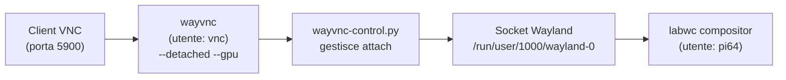
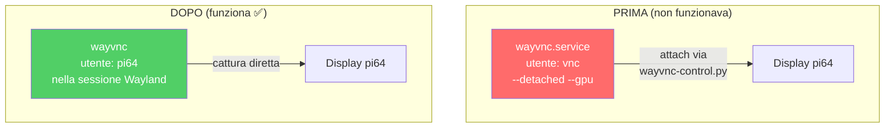

# Risoluzione Schermo Nero VNC e Raspberry Pi Connect — Raspberry Pi 3

**Data:** 29 Giugno 2026  
**Dispositivo:** Raspberry Pi 3 Model B Rev 1.2  
**OS:** Debian GNU/Linux 13 (Trixie) — Raspberry Pi OS  
**Display Server:** Wayland (labwc compositor)

---

## Problema

Il Raspberry Pi mostrava uno **schermo nero** quando ci si collegava da remoto, sia con:
- **VNC diretto** (porta 5900 sulla rete locale)
- **Raspberry Pi Connect** (connect.raspberrypi.com)

Il desktop era in realtà funzionante (confermato tramite screenshot con `grim`), ma nessun sistema di visualizzazione remota riusciva a catturarlo.

---

## Diagnosi

### Architettura originale del VNC di sistema

Il Raspberry Pi OS Trixie configura il VNC in questo modo:



> [!IMPORTANT]
> Il servizio `wayvnc.service` gira come utente separato `vnc` in modalità `--detached`, creando un **proprio compositor headless**. Poi `wayvnc-control.py` dovrebbe agganciarlo ("attach") al display reale di `pi64`.

### Cause trovate

| # | Causa | Impatto |
|---|-------|---------|
| 1 | **Flag `--gpu`** su wayvnc | L'accelerazione GPU per la cattura schermo non funziona correttamente sul Pi 3 (driver vc4). Causa schermo nero nel flusso VNC |
| 2 | **Modalità `--detached`** (utente `vnc` separato) | wayvnc crea il proprio compositor e deve "agganciarsi" al display di pi64 tramite `wayvnc-control.py`. Questo meccanismo di attach è instabile sul Pi 3 (crash con Segmentation Fault) |
| 3 | **Raspberry Pi Connect** usa il proprio wayvnc | Istanza separata con config vuoto (`/etc/rpi-connect/wayvnc.config` — file da 0 byte). Stesso problema di cattura schermo |

### Prova definitiva

Uno screenshot catturato con `grim` direttamente dalla sessione Wayland di pi64 produceva un file PNG valido di **2 MB** (1920×1080, contenuto desktop visibile), confermando che il desktop funzionava ma i server VNC non riuscivano a catturarlo.

---

## Soluzione applicata

### 1. Disabilitato il servizio wayvnc di sistema

```bash
sudo systemctl stop wayvnc.service wayvnc-control.service
sudo systemctl disable wayvnc.service
```

> [!NOTE]
> Il vecchio servizio girava come utente `vnc` in modalità `--detached --gpu`. Entrambi i flag causavano problemi sul Pi 3.

### 2. Avviato wayvnc nella sessione Wayland di pi64

Invece di usare un utente separato con attach, wayvnc ora gira **direttamente nella sessione di pi64**:

```bash
export XDG_RUNTIME_DIR=/run/user/1000
export WAYLAND_DISPLAY=wayland-0
wayvnc --render-cursor 0.0.0.0 5900 &
```

Configurazione semplificata in `~/.config/wayvnc/config`:
```ini
address=0.0.0.0
port=5900
```

### 3. Configurato autostart permanente

Aggiunto wayvnc all'autostart di labwc in [~/.config/labwc/autostart](file:///home/pi64/.config/labwc/autostart):

```bash
/usr/bin/lwrespawn /usr/bin/pcmanfm-pi &
/usr/bin/lwrespawn /usr/bin/wf-panel-pi &
/usr/bin/kanshi &
/usr/bin/lxsession-xdg-autostart

# VNC server nella sessione Wayland
wayvnc --render-cursor 0.0.0.0 5900 &
```

### 4. Accesso remoto via Tailscale

Tailscale era già installato e configurato. Il Pi è raggiungibile da qualsiasi rete tramite la VPN:

| Dispositivo | IP Tailscale | Stato |
|---|---|---|
| raspberrypi | `100.73.29.119` | ✅ Online |
| gt13-pro (PC) | `100.81.177.45` | ✅ Online |

---

## Come connettersi

### Dalla stessa rete locale (Wi-Fi del cancello)
```
VNC → 192.168.1.64:5900
```

### Da qualsiasi altra rete (remoto)
```
VNC → 100.73.29.119:5900
```
Richiede Tailscale attivo su entrambi i dispositivi.

> [!WARNING]
> L'autenticazione VNC è attualmente **disabilitata** (per test). Chiunque sulla rete locale o sulla rete Tailscale può connettersi senza password. Tailscale fornisce già un livello di sicurezza (solo i tuoi dispositivi possono raggiungerlo), ma se vuoi aggiungere autenticazione PAM, modifica `~/.config/wayvnc/config`:
> ```ini
> address=0.0.0.0
> port=5900
> enable_auth=true
> enable_pam=true
> ```

---

## Modifiche collaterali

### Chiave SSH copiata
È stata creata una chiave SSH sul PC (`~/.ssh/id_rsa`) e copiata sul Pi, permettendo l'accesso SSH senza password:
```powershell
ssh pi64@192.168.1.64        # rete locale
ssh pi64@100.73.29.119       # remoto via Tailscale
```

### Backup creato
Lo script originale di avvio VNC è stato salvato:
```
/usr/sbin/wayvnc-run.sh.bak  (script originale con --gpu)
```

### File temporanei creati (eliminabili)
Nella cartella del progetto sul PC:
- `fix_vnc_wayland.py` — primo tentativo di fix
- `diagnose_vnc.py` / `diagnose_vnc2.py` — script di diagnostica
- `fix_vnc_attach.py` — tentativo fix attach
- `fix_vnc_final.py` — tentativo riavvio servizio
- `fix_vnc_gpu.py` — rimozione flag GPU
- `fix_vnc_session.py` — fix definitivo (wayvnc in sessione pi64)
- `fix_remote.py` — riavvio rpi-connect + verifica Tailscale

---

## Ripristino (se necessario)

Se in futuro vuoi tornare al servizio VNC di sistema originale:

```bash
# Ripristina lo script originale
sudo cp /usr/sbin/wayvnc-run.sh.bak /usr/sbin/wayvnc-run.sh

# Riabilita il servizio
sudo systemctl enable --now wayvnc.service

# Rimuovi wayvnc dall'autostart di labwc
nano ~/.config/labwc/autostart
# Rimuovi la riga: wayvnc --render-cursor 0.0.0.0 5900 &
```

---

## Riepilogo



La soluzione è stata eliminare la complessità del servizio separato (utente `vnc` + detached + GPU + attach) e far girare wayvnc **direttamente nella sessione desktop di pi64**, dove può catturare lo schermo senza intermediari.
